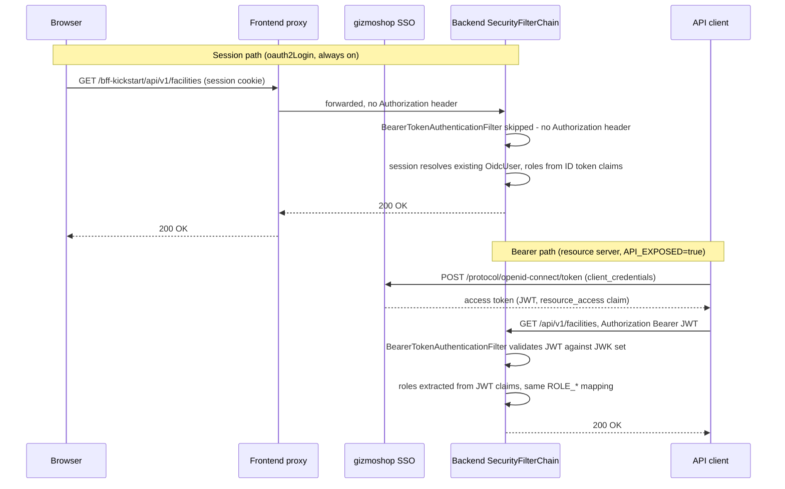

# BFF Kickstart

A starter app for gizmo-manufacturing inspection and reporting tools:

- **Frontend**: React + Vite + TypeScript + TanStack Query + HeroUI, served at `/bff-kickstart`
- **Backend**: Spring Boot 3.5 (REST + Hibernate/JPA + Flyway) on Java 17 (package `com.example.bffkickstart`) - never reachable directly; the frontend's own proxy nests its entire surface under `/bff-kickstart` (e.g. `/bff-kickstart/api/v1/facilities`), so a browser never sees the backend's real, internal-only path (`/bff-kickstart-api`). The API itself is versioned (`/api/v1/...`).
- **Auth**: gizmoshop SSO (OIDC) via a backend-for-frontend (BFF) pattern - the browser only ever holds a session cookie, never a token. Supports back-channel logout and a 5-minute inactivity timeout with a warning countdown.
- **Database**: the local gizmoshop SSO stand-in (see below) keeps its own Postgres; the app itself runs on an **in-memory H2 database in Oracle compatibility mode** (`MODE=Oracle` - the closest stand-in for Oracle's SQL dialect without an Oracle license) - nothing the app stores persists across a backend restart, it's reseeded from Flyway migrations every time
- **Demo domain**: gizmo-manufacturing permits/inspections (Facilities, Permits, Inspections) with full CRUD, data tables, filtering, and a CSV/PDF compliance report
- **Codegen**: `npm run generate` (Plop) scaffolds a new CRUD feature module

See `frontend/README.md` for the frontend developer guide (feature-module conventions, validation, security, session timeout, styling, proxying in depth).

**Digging into the auth architecture?** See [`docs/`](docs/) for two audience-sized versions of
it: a checklist for adding a secure feature, and a full reference (threat model, hardening,
extending it) for whoever owns this long term.

## Identity provider: gizmoshop SSO

This app authenticates against **gizmoshop SSO**, gizmoshop's own centrally-run identity service -
in dev/test, that's `https://sso.gizmoshop.example/gizmoshop-auth` (a Keycloak instance, mounted
under the `/gizmoshop-auth` context root). You don't run, provision, or administer this yourself,
any more than you'd run your own copy of Active Directory: an identity/platform team owns the
realm, clients, and users, and this app is just one client registered against it.

**Everything else in this document that mentions Keycloak directly - the `keycloak` container in
`docker-compose.yml`, the realm-export JSON, the admin console, the custom theme/SPI - is a
*local-only stand-in* for gizmoshop SSO**, so you can develop and test the full sign-in flow on
your laptop without needing access to the real service or your own realm there. It's built from
the same Keycloak version and realm shape as gizmoshop SSO, close enough that the login flow,
roles, and claims all behave the same way locally as they will once this app is pointed at the
real thing - but it is not gizmoshop SSO, and changes you make to it (adding a role, editing a
user) only ever affect your own machine.

Pointing this app at the real gizmoshop SSO instance instead of the local stand-in is just a
matter of setting the `KEYCLOAK_*_URI`/`KEYCLOAK_CLIENT_ID`/`KEYCLOAK_CLIENT_SECRET` environment
variables (already parameterized in `docker-compose.yml`'s `backend` service and
`backend/src/main/resources/application.properties`, defaulted there to the local stand-in) to
whatever your identity/platform team gives you for this app's registered client there - no code
change. See
[docs/03-full-reference.md](docs/03-full-reference.md#local-stand-in-vs-the-real-gizmoshop-sso)
for the mechanics of the local stand-in specifically, and what does/doesn't carry over to the real
thing.

## One-time host setup (local dev only)

The local Keycloak stand-in needs to be reachable at the exact same `keycloak:8080` URL from both
your browser and from the other containers, so the tokens it issues validate correctly everywhere.
Add this line to `/etc/hosts` (requires sudo):

```
127.0.0.1 keycloak
```

Without this, login against the local stand-in will fail or loop. This has nothing to do with the
real gizmoshop SSO instance, which you reach over the network like any other gizmoshop application.

## Running everything with Docker Compose

The local identity stand-in is built from a custom image (`keycloak/Dockerfile`) that bakes in a
gizmoshop-branded theme and a registration provider - reference implementations for whoever
operates the real gizmoshop SSO, included here mainly for local-dev parity (see
[docs/03-full-reference.md](docs/03-full-reference.md#local-stand-in-vs-the-real-gizmoshop-sso) if
you're curious; day-to-day feature work doesn't touch this). Build its jar once before the first
`docker compose up --build`:

```bash
mvn -f keycloak/providers/bff-registration-spi/pom.xml clean package
cp .env.example .env   # defaults work as-is
docker compose up --build
```

| Service | URL |
|---|---|
| Frontend (and the API, nested under it - see `frontend/README.md`'s "Backend proxying") | http://localhost:3000/bff-kickstart/ |
| Backend (direct - for debugging only; a browser never uses this) | http://localhost:8081/bff-kickstart-api |
| Local gizmoshop SSO stand-in admin console (Keycloak) | http://keycloak:8080/admin (admin/admin) |
| Mailhog (view "sent" email - see "Email (SMTP demo)" below) | http://localhost:8025 |

Demo users (password `password` for all): `admin` (all roles), `inspector` (Inspector + Viewer), `viewer` (read-only), `manager` (Viewer + Data Manager). These sign in exactly as before - the new self-registration path (below) is additive and doesn't touch them.

## Local development (hot reload, infra still in Docker)

Run infrastructure in Docker, but the frontend and backend directly on your machine:

```bash
docker compose up postgres-keycloak keycloak mailhog
```

Backend (Java 17):

```bash
cd backend
mvn spring-boot:run
```

Frontend:

```bash
cd frontend
npm install
npm run dev   # http://localhost:5173/bff-kickstart/, proxies /bff-kickstart/{api,oauth2,login,logout} to :8081
```

## Running without Docker

Everything above also runs with **no Docker at all** - useful if it's simply not installed, or your
org's policy doesn't allow it. Nothing here changes the Docker path above; both are fully
supported side by side, and the same running-app experience results either way.

The one piece with no simple native equivalent is Keycloak itself, so
[`scripts/run-keycloak-native.sh`](scripts/run-keycloak-native.sh) handles it: it downloads the
official Keycloak distribution once (cached in `keycloak/.dist/`, gitignored), copies in this
repo's theme/registration SPI/realm export - the same three things `keycloak/Dockerfile` bakes into
the image - and starts it in dev mode on `:8080` against its own embedded dev database, no Postgres
needed for this piece at all. Everything else has a normal native path:

| Piece | Docker service | Native equivalent |
|---|---|---|
| Identity (Keycloak) | `keycloak` | `./scripts/run-keycloak-native.sh` |
| Mail (SMTP demo) | `mailhog` | [Mailpit](https://mailpit.axllent.org/) (`brew install mailpit && mailpit`) - a maintained, wire-compatible Mailhog replacement (Mailhog itself is unmaintained), same default ports (1025 SMTP, 8025 web UI) |
| Backend | `backend` | `cd backend && mvn spring-boot:run` |
| Frontend (dev, hot reload) | `frontend` | `cd frontend && npm install && npm run dev` |
| Frontend (production-style build, no nginx) | `frontend` | `cd frontend && npm run build && npm run preview` |

Add **both** aliases to `/etc/hosts` (only `keycloak` is needed for the Docker path above - `mailhog`
is only for this native one, since it's server-to-server: the backend and Keycloak's own
"forgot password" email both send through it, and neither is browser-facing):

```
127.0.0.1 keycloak
127.0.0.1 mailhog
```

With those in place, the backend's default `KEYCLOAK_*_URI`/`SMTP_HOST` values (already pointed at
`keycloak`/`mailhog`, `application.properties`) work completely unmodified - they don't know or
care whether the thing answering at those hostnames is a container or a native process on the same
machine. Bring it up in whatever order:

```bash
./scripts/run-keycloak-native.sh   # first run downloads Keycloak; leave running in its own terminal
brew install mailpit && mailpit    # leave running in its own terminal
cd backend && mvn spring-boot:run  # leave running in its own terminal
cd frontend && npm install && npm run dev
```

The only code-level difference from the Docker path: `vite preview` (used by the "production-style
build" row above) needed its own copy of the dev server's backend-proxying config
(`frontend/vite.config.ts`'s `preview.proxy`) - without it, a built-and-previewed frontend had
nothing to rewrite `/bff-kickstart/api/**` onto, since that rewriting is normally nginx's job
(`nginx.conf.template`) in the Docker path, and `vite preview` doesn't run nginx.

## Security architecture

The backend runs **two OAuth2 authentication mechanisms side by side, in a single `SecurityFilterChain`** (`backend/.../config/SecurityConfig.java`):

1. **OAuth2 Client** (a backend-for-frontend / BFF) - always on. The browser holds a session cookie; the backend holds the actual OIDC tokens and talks to gizmoshop SSO on the browser's behalf. This is what the SPA uses.
2. **OAuth2 Resource Server** - opt-in via `API_EXPOSED` (see below). Lets *other* API clients - machine-to-machine callers with no browser, no session, no cookie - authenticate by presenting an `Authorization: Bearer <JWT>` header directly, typically obtained via gizmoshop SSO's `client_credentials` grant.

These coexist without a second filter chain or URL-based split: Spring Security's `BearerTokenAuthenticationFilter` only activates when a request actually carries an `Authorization: Bearer` header. Everything else - every request the SPA makes - falls through to the session-based authentication untouched, exactly as before this feature existed.



### Role mapping - shared by both mechanisms

gizmoshop SSO issues roles as **Keycloak client roles** on `bff-kickstart-client` (not realm roles), delivered in a `resource_access.bff-kickstart-client.roles` token claim - see [Roles](#roles) below. That claim shows up in two different places depending on which auth mechanism produced the token, so `backend/.../security/KeycloakRealmRoleConverter.java` has one method for each, both funneling through the same private claim-parsing logic and producing identical `ROLE_*` `GrantedAuthority` objects:

| Auth mechanism | Token / claim source | Converter method | Wired up in |
|---|---|---|---|
| OAuth2 Client (session) | the ID token's claims, on the `OidcUserAuthority` | `extractResourceAccessRoles(...)` | `SecurityConfig#grantedAuthoritiesMapper`, passed to `.oauth2Login().userInfoEndpoint().userAuthoritiesMapper(...)` |
| OAuth2 Resource Server (Bearer) | the access token JWT's own claims, via `Jwt.getClaims()` | `extractJwtAuthorities(...)` | `SecurityConfig#jwtAuthenticationConverter`, passed to `.oauth2ResourceServer().jwt().jwtAuthenticationConverter(...)` |

Because both paths land on the same `ROLE_*` naming, every `@PreAuthorize("hasRole(...)")` / `hasAnyRole(...)` annotation on every controller (`FacilityController`, `PermitController`, `InspectionController`, `ReportController`, `StateCodeController`, `MailController`, `DailyReportController`) works identically no matter which mechanism authenticated the caller - no controller code is aware of the distinction at all.

### CSRF

Session-cookie requests still require the `X-XSRF-TOKEN` header (see `frontend/README.md`), since a cookie can be silently replayed by a browser cross-site. Bearer-token requests are exempt from CSRF - a Bearer token can't be attached to a request the caller didn't deliberately construct, so there's nothing CSRF protection is guarding against - via `SecurityConfig`'s conditional check on the `Authorization` header, active only when `API_EXPOSED=true` (see below). The check specifically requires a `Bearer ` prefix, not just header presence - an earlier, looser version of this check (matching on any `Authorization` header at all) was a confirmed CSRF bypass, since a non-Bearer value skips CSRF but still falls through to session-cookie auth; see [docs/03-full-reference.md](docs/03-full-reference.md#csrf-bypass-via-a-non-bearer-authorization-header) for the full incident.

### Configuration

Both additions below are **off by default** - a plain `docker compose up` behaves exactly as it did before this feature existed. Set them in `.env` (see `.env.example`) or as plain environment variables; both are read by `backend/src/main/resources/application.properties` and passed through `docker-compose.yml`'s `backend` service.

| Variable | Default | Effect when `true` |
|---|---|---|
| `API_EXPOSED` | `false` | Enables the OAuth2 Resource Server: `/api/**` accepts `Authorization: Bearer <JWT>` in addition to the session cookie, and Bearer requests are exempted from CSRF. When `false`, a Bearer header on `/api/**` is simply ignored (nothing consumes it), so the request is treated as unauthenticated and gets the normal 401 JSON body. |
| `SWAGGER_ENABLED` | `false` | Enables springdoc's generated OpenAPI docs (`/v3/api-docs`) and Swagger UI (`/swagger-ui/index.html`), auto-describing every `@RestController` endpoint with no per-controller annotations required. |

Both flags map directly to Spring properties - `app.api-exposed` and `springdoc.api-docs.enabled` / `springdoc.swagger-ui.enabled` respectively - and the JWK set used to validate Bearer JWTs reuses the same `KEYCLOAK_JWK_SET_URI` already used for the OAuth2 Client's own token verification (`spring.security.oauth2.resourceserver.jwt.jwk-set-uri` in `application.properties`) - no separate gizmoshop SSO endpoint or credential is needed for the backend to *validate* tokens, only to *issue* them (that's between the calling API client and gizmoshop SSO directly).

**Security note:** `/v3/api-docs` and `/swagger-ui/**` are gated behind the `API Developer` role (see [Roles](#roles) and [API docs (Swagger)](#api-docs-swagger) below) - reachable through the frontend's own proxy same as everything else, never directly off the backend's port. Think twice before enabling `SWAGGER_ENABLED` on a real deployment with real data even so, since it publishes your full API shape (and, indirectly, that resource-server support exists at all) to anyone holding that role.

### Try it: calling the API as a machine client

Below hits the **local gizmoshop SSO stand-in** (`localhost:8080`) - against the real gizmoshop SSO
instance, step 1 targets its token endpoint instead, and `client_id`/`client_secret` come from your
identity/platform team rather than this repo. A demo `client_credentials` client is included in
the local stand-in: `bff-kickstart-service-client` / `bff-kickstart-service-secret`, granted the
`Viewer` and `Data Manager` client roles (see `keycloak/realm-export/gizmoshop-realm.json`). With
`API_EXPOSED=true` (`API_EXPOSED=true docker compose up -d backend` if it's already running):

```bash
# 1. Get an access token via the client_credentials grant
TOKEN=$(curl -s http://localhost:8080/realms/gizmoshop/protocol/openid-connect/token \
  -d grant_type=client_credentials \
  -d client_id=bff-kickstart-service-client \
  -d client_secret=bff-kickstart-service-secret \
  | jq -r .access_token)

# 2. Call a protected endpoint with it (Viewer role covers read access)
curl -s http://localhost:8081/bff-kickstart-api/api/v1/facilities -H "Authorization: Bearer $TOKEN" | jq .

# 3. An admin-only action correctly 403s - this client only has Viewer + Data Manager
curl -i -X DELETE http://localhost:8081/bff-kickstart-api/api/v1/facilities/1 -H "Authorization: Bearer $TOKEN"
```

Swap step 2/3's host for `http://localhost:3000/bff-kickstart/api/v1/facilities` (nginx) or `http://localhost:5173/bff-kickstart/api/v1/facilities` (Vite dev server) to confirm the same call also works through the frontend's own proxy, with zero proxy configuration for this feature - the `Authorization` header passes through either proxy unmodified, same as any other header.

## Email (SMTP demo)

Both the backend app and the local gizmoshop SSO stand-in send email through **Mailhog**, a fake SMTP server that never actually delivers anything - open its web UI at http://localhost:8025 to see what was "sent." Configured via two env vars, both defaulting to Mailhog's compose service name/port:

| Variable | Default | Used by |
|---|---|---|
| `SMTP_HOST` | `mailhog` | The backend's `spring.mail.host` (`application.properties`) |
| `SMTP_PORT` | `1025` | The backend's `spring.mail.port` |

The local stand-in's own realm SMTP settings (`keycloak/realm-export/gizmoshop-realm.json`'s `smtpServer` block, used for things like the "Forgot Password" email) point at the same `mailhog:1025` - hardcoded there rather than reading these env vars, since Keycloak's realm-import doesn't resolve `${env.VAR}`-style placeholders inside `smtpServer` (verified empirically; it silently imports the literal placeholder text instead). The values are identical to `SMTP_HOST`/`SMTP_PORT`'s own defaults, so in practice both send through the same place.

Any signed-in user, regardless of role, can send a test email from the home page's **"Send Email"** button - recipient, subject, and message, sent from `noreply@gizmoshop.example` with the gizmoshop logo embedded (`backend/.../service/MailService.java`, `POST /api/v1/emails`). Mailhog's own message preview doesn't render inline (`cid:`) images, so the logo shows as a broken-image icon there even though it's correctly embedded - check the message's "MIME" tab to confirm the `multipart/related` structure instead.

## Roles

Roles are Keycloak **client roles** on the `bff-kickstart-client` client (not realm roles), delivered in the `resource_access.bff-kickstart-client.roles` token claim and mapped to Spring `ROLE_*` authorities by `KeycloakRealmRoleConverter` (see [Security architecture](#security-architecture) above for how this works for both session and Bearer-token callers). Against the **local gizmoshop SSO stand-in**, manage them in its admin console under the client's "Roles" tab, or edit `keycloak/realm-export/gizmoshop-realm.json` before first import. Against the **real gizmoshop SSO**, this app doesn't own role management at all - adding a role or assigning one to a user goes through your identity/platform team's normal process for the shared realm, the same as any other gizmoshop application registered there.

- **Admin** - full CRUD on everything
- **Inspector** - CRUD inspections, read-only on facilities/permits
- **Viewer** - read-only on everything
- **Data Manager** - bulk CSV export/import on every resource (orthogonal to the CRUD roles above - it does not imply read/write access on its own, see the `Viewer` role granted alongside it on the `manager` demo user)
- **API Developer** - can reach Swagger UI and `/v3/api-docs` (see [API docs (Swagger)](#api-docs-swagger) below). Orthogonal to every role above: it only gates *seeing* the docs, not what a call actually does once made - the demo `apideveloper` user is also given `Viewer` so there's something to read.
- **API Owner** - a composite role: any operation on any endpoint, plus Swagger access. It's defined in the realm export as a composite of `Admin`+`Inspector`+`Viewer`+`Data Manager`+`API Developer` (`roles.client.bff-kickstart-client` - look for `"composite": true`), so a user granted only `API Owner` gets all five expanded into their token's `resource_access` claim automatically at sign-in - no `@PreAuthorize` on any controller needed to know about it. See the demo `apiowner` user.

## API docs (Swagger)

Springdoc-openapi is wired up but gated behind both the app's normal BFF session auth *and* the `API Developer` role - `SecurityConfig#securityFilterChain` requires `hasRole("API Developer")` on `/v3/api-docs/**` and `/swagger-ui/**` before anything else. The served page is also reskinned to match the rest of the app (gizmoshop green header, logo, "BFF Kickstart - API Docs" title) via a `SwaggerIndexTransformer` bean in `SwaggerBrandingConfig` - Swagger UI is Apache-2.0 licensed, so restyling its header for an internal tool is a non-issue license-wise. Reasoning through what that means in practice:

- **Enable it first**: `SWAGGER_ENABLED=true` in `.env` (defaults to `false` - springdoc's endpoints don't exist at all otherwise, regardless of role).
- **Reached entirely through the frontend's own proxy, same as every other backend-owned path** - `http://localhost:3000/bff-kickstart/swagger-ui.html` (springdoc's default path, nested under `FRONTEND_BASE_PATH` like `/api`, `/oauth2`, `/login` already are - see `nginx.conf.template`'s `/swagger-ui/` and `/v3/api-docs` locations, and `vite.config.ts`'s dev-server proxy for the `npm run dev` equivalent). The backend has no browser-facing port of its own for this either, by design - it's never meant to be routable from outside the container network. Log in via the frontend first, then navigate to that URL directly. Don't expect to land on Swagger straight from a cold, unauthenticated hit on it: `SecurityConfig`'s OAuth2 login success handler always redirects to the frontend's home page after any login (a deliberate choice - see the comment above `.successHandler(...)`), not back to whatever URL triggered the login, so a cold hit bounces you home, not to Swagger.
- **"Try it out" and CSRF**: a mutating call fired from Swagger UI's own JS won't automatically carry the app's `X-XSRF-TOKEN` header, so it'll 403 unless you copy the `XSRF-TOKEN` cookie's value into the header manually via Swagger's UI. This is a known rough edge, not a bug - see [docs/02](docs/02-adding-a-secure-feature.md) and the one thing to internalize there: the frontend layer is convenience, and the same is true of Swagger's own request-building UI.
- **Roles still apply underneath**: reaching Swagger doesn't change what any given call is authorized to do - a `Viewer` + `API Developer` user can browse the docs and issue GETs, but a POST from Swagger 403s exactly the same as it would from `curl`, because the underlying `@PreAuthorize` checks never moved.

## Session lifecycle

The frontend logs the user out after **5 minutes of inactivity** (`SessionTimeoutMonitor`, with a warning/countdown starting at the 4-minute mark - see `frontend/README.md`'s "Session timeout" section) and gizmoshop SSO's own SSO session also expires after 5 minutes idle (`ssoSessionIdleTimeout` in the realm export, local stand-in only - the real gizmoshop SSO's session timeout is whatever your identity/platform team has configured for the shared realm). The backend's own session (`server.servlet.session.timeout` in `application.properties`) is set longer, at 15 minutes - it only needs to outlive the frontend's timer so that the client-triggered logout always has a live, authenticated session to complete gizmoshop SSO's RP-initiated logout redirect against; letting it expire at the same instant as the frontend's timer left logout landing on a bare 404 instead of back on the app.

**Back-channel logout** is enabled: if a session is killed from gizmoshop SSO's side (an admin forces a logout, or the user logs out of another app sharing the same SSO session), it calls the backend directly at `/bff-kickstart-api/logout/connect/back-channel/keycloak` to kill the local session too - see the client's `backchannel.logout.url` attribute in the realm export and `SecurityConfig#securityFilterChain`'s `.oidcLogout(...)`.

## Local identity stand-in: theme + registration SPI

The local gizmoshop SSO stand-in also bakes in a gizmoshop-branded theme and a custom registration
provider (`keycloak/themes/gizmoshop/`, `keycloak/providers/bff-registration-spi/`) - reference
implementations of what gizmoshop SSO's own platform team would run centrally, useful for seeing
the full branded sign-up flow locally. **This isn't something feature developers on this app build
or maintain** - see
[docs/03-full-reference.md](docs/03-full-reference.md#local-stand-in-vs-the-real-gizmoshop-sso) if
you're the one operating the local stand-in itself (rebuilding it after a theme/SPI/realm change,
what `kickstart.sh` does and doesn't rebrand about it, etc.).

## Adding a new feature

```bash
cd frontend
npm run generate
```

This scaffolds `src/types/<entity>.ts` and `src/features/<resource>/{api.ts, <Entity>Form.tsx, <Entity>Page.tsx, index.ts}` following the same conventions as the Facilities/Permits/Inspections features - including the module-boundary rule that other features may only import through a feature's `index.ts` (see `frontend/README.md`). It prints the remaining manual steps (add the route, the nav link, and the backend controller/entity/service) when it finishes.

## Validation

Every form validates on both sides:

- **Client**: `zod` schemas in `frontend/src/types/*.ts`, wired into forms via `react-hook-form` + `@hookform/resolvers`
- **Server**: Jakarta Bean Validation annotations on the request DTOs in `backend/.../dto/*Request.java`, enforced regardless of what the client sends

## Reports

`GET /bff-kickstart/api/v1/reports/compliance` returns the compliance report as JSON (used for the in-app preview); `/csv` and `/pdf` return downloadable files built from the same data (`backend/.../service/ReportService.java`).

## Why these technologies, specifically

Every stack has competing options at every layer. These are the ones this template picked, and the
actual reasoning - including where the runner-up would also have been fine, which is most of the
time. None of this is "X is bad" - it's "X wasn't the better fit for a starter template meant to be
forked by teams with unpredictable size, skill mix, and infrastructure constraints."

**Axios over the native `fetch` API.** This is the one place fighting the platform default actually
paid for itself, because the BFF pattern leans on two things `fetch` doesn't give you for free:

- **Interceptors.** `src/lib/api-client.ts`'s response interceptor is what makes a revoked session
  show up instantly on whatever page the user happens to be on - it fires on *any* `401` from *any*
  call, mutation or query, and flips the app to signed-out state without every feature needing its
  own error-handling code for that case (see `frontend/README.md`'s "Staying signed out when
  gizmoshop SSO says so"). Reproducing this with `fetch` means either wrapping every single call in
  a shared helper by hand, or writing your own `fetch` monkey-patch - at which point you've built a
  worse version of what axios already ships.
- **`xsrfCookieName`/`xsrfHeaderName`.** Axios reads the `XSRF-TOKEN` cookie and attaches it as
  `X-XSRF-TOKEN` on every request automatically - this is the actual mechanism the CSRF protection
  in `SecurityConfig` depends on client-side (see the root README's CSRF section). `fetch` has no
  equivalent; you'd hand-read `document.cookie` and set the header yourself, on every call site, and
  get it wrong once eventually.
- **Rejects on non-2xx.** `fetch` only rejects on network failure - a 500 is a "successful" fetch you
  have to manually check `response.ok` on. Axios throwing means the interceptor above and every
  call site's error handling both work the way you'd naively expect.

The cost: a dependency, and a slightly larger bundle than zero-`fetch`. For an app whose entire
security model runs through those interceptors, that's not a close call.

**TanStack Query over Redux Toolkit Query, SWR, or hand-rolled `useEffect`.** This app has no
client-only state worth a global store - everything the UI shows either came from the API or is
form-local - so Redux (Toolkit Query included) would mean adopting store/slice ceremony purely to
get a data-fetching layer, when a data-fetching layer is all that's actually needed. TanStack
Query's query-key invalidation model (`queryClient.invalidateQueries(['facilities'])` after a
mutation) maps directly onto this app's one-feature-per-resource structure - each feature's
`hooks/` module owns its own key. SWR is a genuinely comparable alternative here; TanStack Query
won on its devtools and a slightly richer mutation API, not a fundamental difference.

**HeroUI over MUI, Ant Design, Chakra, or shadcn/ui.** MUI's Material Design language and Ant
Design's own design system both carry a strong visual identity that fights a from-scratch brand
(exactly the DEP-blue-then-gizmo-green situation this template has actually been through - see
`docs/theme-blue.patch`); HeroUI's components are accessible and unstyled enough to take brand
colors directly through Tailwind tokens without a fight. shadcn/ui is a real alternative worth
naming specifically: it isn't a dependency at all, it's components you copy into your own repo and
own outright - more ultimate control, at the cost of manually re-copying upstream fixes forever
instead of bumping a version number. For a template meant to be forked repeatedly, "upgrade is a
version bump" mattered more than maximum control.

**Tailwind CSS over CSS Modules or styled-components/emotion.** Utility classes stay colocated with
the component that uses them - no parallel `.module.css` file to keep in sync, no CSS-in-JS runtime
cost on every render. The tradeoff is real: class-heavy JSX is denser to read than a clean external
stylesheet, and Tailwind's own learning curve isn't nothing. It's a bet that "one file per
component instead of two" and "the brand palette lives in one `:root` block" (`index.css`) both
outweigh that density, especially for a template whose whole point is being cloned and re-themed.

**Zod + react-hook-form over Yup + Formik.** Zod's `z.infer<typeof schema>` derives the TypeScript
type directly from the validation schema - one source of truth, not a schema plus a hand-maintained
matching interface. Yup predates good TypeScript inference and needs the latter. react-hook-form's
uncontrolled-input model means typing in one field doesn't re-render the rest of the form; Formik's
older controlled-component default does, which shows on longer forms (this app's registration form,
for one).

**oxlint over ESLint - the one place speed was explicitly chosen over completeness.** oxlint (Rust,
from the Oxc project) lints in a fraction of ESLint's time, but it's a genuinely smaller rule set -
`frontend/README.md`'s own feature-boundary rule ("a feature may only be imported through its
`index.ts`") calls out that oxlint has no equivalent of ESLint's `import/no-restricted-paths`, so
that rule is enforced by convention and code review, not tooling, here. A team that wants that rule
machine-enforced should expect to swap in ESLint (or add it alongside) - that's an explicit,
documented tradeoff, not an oversight.

**Spring Boot over Micronaut, Quarkus, or a non-JVM backend (Node/Express, Django).** The entire BFF
pattern rides on `spring-boot-starter-oauth2-client`'s `SecurityFilterChain` composition - Spring
Security's OAuth2 support is the most battle-tested implementation of this exact pattern in the JVM
world, and this app's dual-mechanism filter chain (session BFF + optional Bearer resource server,
see "Security architecture" above) leans on primitives (`OidcSessionRegistry`,
`BearerTokenAuthenticationFilter`, `ForwardedHeaderFilter`) that Micronaut/Quarkus have their own
comparable-but-less-traveled equivalents of. Micronaut/Quarkus's real advantage - faster
startup, lower memory, better for scale-to-zero/serverless - matters more for a fleet of
short-lived functions than a normal always-on internal tool. Node/Express or Django were never
serious contenders for the same reason many agencies standardize on the JVM in the first place:
existing operational tooling, existing team skills, one fewer runtime to patch and monitor.

**Hibernate/JPA over jOOQ or plain JDBC.** Spring Data JPA makes a new CRUD feature nearly
boilerplate-free - an entity, a repository interface, done - matching this template's own
`npm run generate`-style philosophy of minimizing what a new feature costs to add. jOOQ's compiled,
type-safe SQL builder is a genuinely better fit once queries get complex enough that JPQL/Criteria
fights you, but it adds a codegen step and a steeper learning curve than most people extending a
starter template will want on day one.

**Flyway over Liquibase.** Plain, ordered `V1__init.sql`-style SQL files are directly readable and
directly runnable outside the migration tool if you ever need to - Liquibase's XML/YAML/JSON
changelog abstraction buys database-vendor portability and scriptable rollbacks, neither of which
this template needs (it targets one vendor's dialect - see `application.properties`'s `MODE=Oracle`
comment).

**OpenPDF over iText or Apache PDFBox.** The deciding factor here is licensing, not API ergonomics:
modern iText (7+) is AGPL or commercial-licensed, which doesn't sit well next to a template meant to
be given away under CC0. OpenPDF is a permissively-licensed (LGPL/MPL) fork of the last
open iText version, so the `Document`/`PdfPTable` API (`ReportService.java`) is exactly what most
Java developers already know from old iText tutorials. PDFBox is a solid Apache-2.0 alternative
too; OpenPDF's API is just the more familiar one for the same permissive-license price.

**Keycloak over Auth0, Okta, or a homegrown identity service.** Auth0 and Okta both charge per
monthly active user past a free tier - a real budget line for a government agency, and a strange
thing to require of software being given away for free. Keycloak is open source, self-hostable, and
has mature OIDC support with an admin console for realm/role/user management - no SaaS account
needed to run the whole stack, including this template's own local dev/demo realm. A homegrown
identity service was never on the table: the entire point of the BFF pattern (see "Security
architecture" above) is *not* reinventing authentication, and that logic applies just as much to
the identity provider itself as to the app in front of it.
