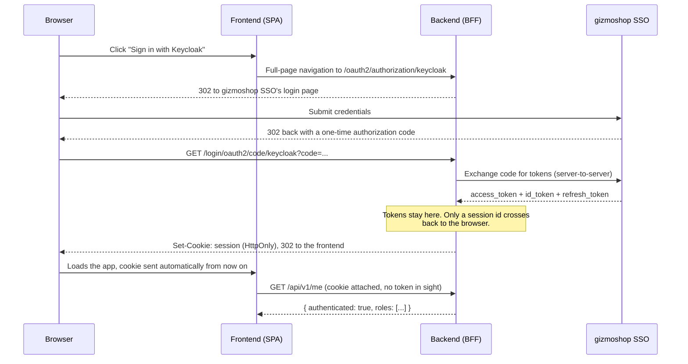
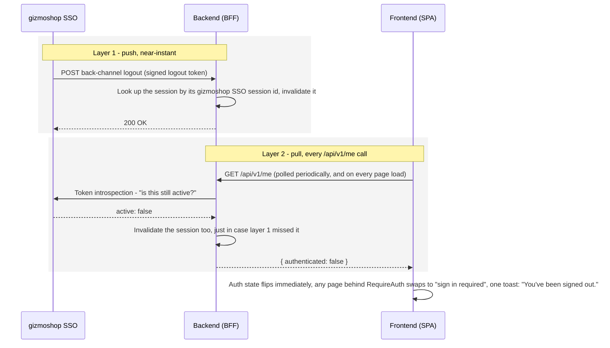

# BFF Kickstart - Frontend

React 19 + Vite + TypeScript + TanStack Query + HeroUI (Tailwind v4). This is the developer-facing README for this package; see the repo root `README.md` for how to run the whole stack (the local gizmoshop SSO stand-in, Postgres, backend) with Docker Compose.

Adding a new feature and want the security checklist that goes with it (roles, `@PreAuthorize`,
what the frontend's `hasRole()` check is and isn't for), rather than just this doc's UI/API
scaffolding steps? See [`../docs/02-adding-a-secure-feature.md`](../docs/02-adding-a-secure-feature.md).

## Running it

```bash
npm install
npm run dev      # http://localhost:5173/bff-kickstart/
```

The dev server proxies the backend's API/auth endpoints (nested under `/bff-kickstart`, not a separate path - see "Backend proxying" below) to a backend running on `http://localhost:8081`. Bring the backend (and Keycloak, and Postgres) up first - see the root README.

Other scripts: `npm run build`, `npm run lint` (oxlint), `npm run preview`, `npm run generate` (Plop - see "Adding a new page with a CRUD form").

## Project structure

```
src/
  app.tsx, main.tsx        - routing, providers, app shell wiring
  auth/                    - AuthContext, sign-in/sign-out, session-timeout monitor
  components/              - shared, feature-agnostic UI (DataTable, form fields, layout)
  lib/                     - api client, query client, shared config constants
  features/
    facilities/
      api/                 - raw fetch functions (apiClient calls), no React - private to the feature
      hooks/               - TanStack Query wrappers around api/ (useFacilities, useCreateFacility, ...) - private
      components/          - FacilityForm.tsx, FacilitiesPage.tsx - private to the feature
      types/               - facility.ts: zod schema + response type - private to the feature
      index.ts             - the feature's PUBLIC surface
    permits/   inspections/   reports/   home/   (same four subdirs)
```

Every feature has exactly these four subdirectories - `api`, `hooks`, `components`, `types` - even when one of them ends up thin (e.g. `reports` has no mutations, just one query). Keep new code in the matching subdir rather than adding a fifth top-level shape.

### The feature-module boundary rule

**A feature may only be imported through its `index.ts`.** Never write `import { useAllFacilities } from '../facilities/hooks/useFacilities'` from another feature - write `import { useAllFacilities } from '../facilities'` instead, and make sure `facilities/index.ts` actually exports it. This is also how cross-feature *types* work: `reports/types/report.ts` needs `PermitStatus` and `PermitType`, and imports them from `'../../permits'` (the barrel), not `'../../permits/types/permit'` directly - see `permits/index.ts` and `inspections/index.ts` for the types/color-maps they re-export specifically because `reports` needs them.

This is a convention, not a tool-enforced rule: oxlint (this project's linter) doesn't have an equivalent of ESLint's `import/no-restricted-paths`, so nothing will flag a violation automatically. Enforce it in code review. Within a feature's own files, import however you like (`./FacilityForm`, `../types/facility`, `../../../lib/api-client`, etc.) - the rule is specifically about *other* features reaching into *this* feature's internals.

Why: it keeps each feature's internal shape (its hook signatures, its form component props, which subdir something lives in) free to change without a repo-wide grep to find every caller. `src/auth`, `src/components`, and `src/lib` are shared infrastructure, not features, and aren't subject to this rule - features are expected to import from them directly.

## Adding a new page with a CRUD form

This walks through adding a full page end to end - a "Vehicles" feature with a data table and a create/edit form - using the same conventions as the real facilities/permits/inspections features. It assumes the matching Spring endpoints already exist on the backend (`@RestController`/`@Entity`/`@Repository`/`@Service` mirroring `FacilityController`/`Facility`/`FacilityRepository`/`FacilityService`) - this README only covers the frontend half.

### 1. Scaffold the feature

```bash
npm run generate
```

```
? Entity name, singular, PascalCase (e.g. Vehicle): Vehicle
? Backend resource path, plural, kebab-case (e.g. vehicles): vehicles
```

This creates `src/features/vehicles/` with all four subdirs - `types/`, `api/`, `hooks/`, `components/` - plus `index.ts`, mirroring facilities/permits/inspections exactly. Everything below is filling in the placeholders it leaves behind (it prints these same steps when it finishes).

### 2. Define the shape: `types/vehicle.ts`

One zod schema (client-side validation) and one response type (what the API returns), kept in sync with the backend's Bean Validation annotations by hand - see "Validation" below.

```ts
import { z } from 'zod';

export const VEHICLE_TYPES = ['SEDAN', 'TRUCK', 'VAN', 'OTHER'] as const;
export type VehicleType = (typeof VEHICLE_TYPES)[number];

export const vehicleSchema = z.object({
  plateNumber: z.string().trim().min(1, 'Plate number is required').max(20, 'Plate number must be at most 20 characters'),
  vehicleType: z.enum(VEHICLE_TYPES, { message: 'Vehicle type is required' }),
  notes: z.string().trim().max(1000, 'Notes must be at most 1000 characters').optional(),
  active: z.boolean(),
});

export type VehicleFormValues = z.infer<typeof vehicleSchema>;

export interface VehicleResponse {
  id: number;
  plateNumber: string;
  vehicleType: VehicleType;
  notes: string | null;
  active: boolean;
  createdAt: string;
  updatedAt: string;
}
```

### 3. Wire up the API calls: `api/vehicles.ts`

Raw `apiClient` calls, no React - the generator already scaffolds `fetchVehicles`/`createVehicle`/`updateVehicle`/`deleteVehicle` against `/vehicles`; add search params here as the page needs them (a free-text `q`, a `vehicleType` filter, sorting - see "Sorting and filtering" below):

```ts
import { apiClient, type Page } from '../../../lib/api-client';
import type { VehicleFormValues, VehicleResponse, VehicleType } from '../types/vehicle';

export interface VehicleSearchParams {
  q?: string;
  vehicleType?: VehicleType | '';
  page: number;
  size: number;
  sort?: string;
}

export async function fetchVehicles(params: VehicleSearchParams): Promise<Page<VehicleResponse>> {
  const { data } = await apiClient.get<Page<VehicleResponse>>('/vehicles', {
    params: { ...params, vehicleType: params.vehicleType || undefined },
  });
  return data;
}

export async function createVehicle(values: VehicleFormValues): Promise<VehicleResponse> {
  const { data } = await apiClient.post<VehicleResponse>('/vehicles', values);
  return data;
}

export async function updateVehicle(id: number, values: VehicleFormValues): Promise<VehicleResponse> {
  const { data } = await apiClient.put<VehicleResponse>(`/vehicles/${id}`, values);
  return data;
}

export async function deleteVehicle(id: number): Promise<void> {
  await apiClient.delete(`/vehicles/${id}`);
}
```

`hooks/useVehicles.ts` (also scaffolded as-is) wraps each of these in `useQuery`/`useMutation`, invalidating the `['vehicles']` query key on every successful mutation - copy the shape from `features/facilities/hooks/useFacilities.ts` if you added extra search params above and need them threaded through.

### 4. Build the form: `components/VehicleForm.tsx`

Every shared field wrapper in `src/components/form/` lives here: `TextInputField`, `SelectField`, `TextAreaField`, `CheckboxField`. `FormErrorSummary` and `useApplyServerErrors` surface the server's validation response (see "Validation" below) - always wire both in, even for a form this small:

```tsx
import { useForm } from 'react-hook-form';
import { zodResolver } from '@hookform/resolvers/zod';
import { Button } from '@heroui/react';
import { TextInputField } from '../../../components/form/TextInputField';
import { SelectField } from '../../../components/form/SelectField';
import { TextAreaField } from '../../../components/form/TextAreaField';
import { CheckboxField } from '../../../components/form/CheckboxField';
import { FormErrorSummary } from '../../../components/form/FormErrorSummary';
import { useApplyServerErrors } from '../../../components/form/useApplyServerErrors';
import { VEHICLE_TYPES, vehicleSchema, type VehicleFormValues } from '../types/vehicle';

const typeOptions = VEHICLE_TYPES.map((t) => ({ value: t, label: t }));

interface VehicleFormProps {
  defaultValues?: Partial<VehicleFormValues>;
  onSubmit: (values: VehicleFormValues) => void;
  onCancel: () => void;
  isSubmitting?: boolean;
  /** The failed create/update mutation's error, if any - see useApplyServerErrors. */
  serverError?: unknown;
}

export function VehicleForm({ defaultValues, onSubmit, onCancel, isSubmitting, serverError }: VehicleFormProps) {
  const { control, handleSubmit, setError } = useForm<VehicleFormValues>({
    resolver: zodResolver(vehicleSchema),
    defaultValues: { plateNumber: '', vehicleType: undefined, notes: '', active: true, ...defaultValues },
  });
  useApplyServerErrors(setError, serverError);

  return (
    <form className="flex flex-col gap-4" onSubmit={handleSubmit(onSubmit)}>
      <FormErrorSummary error={serverError} />
      <TextInputField control={control} name="plateNumber" label="Plate number" isRequired />
      <SelectField control={control} name="vehicleType" label="Vehicle type" options={typeOptions} isRequired />
      <TextAreaField control={control} name="notes" label="Notes" />
      <CheckboxField control={control} name="active" label="Vehicle is active" />
      <div className="mt-2 flex justify-end gap-2">
        <Button type="button" variant="ghost" onPress={onCancel} isDisabled={isSubmitting}>
          Cancel
        </Button>
        <Button type="submit" isDisabled={isSubmitting}>
          {isSubmitting ? 'Saving…' : 'Save'}
        </Button>
      </div>
    </form>
  );
}
```

### 5. Build the page: `components/VehiclesPage.tsx`

`DataTable` handles paging and (via `sortable: true` on a column, plus `sortBy`/`sortDir`/`onSortChange` from `useSort`) server-side sorting; `FilterSelect` is a dropdown filter with a built-in "show everything" option. Mutation errors go through `showActionError` (from `lib/api-client.ts`), which skips the toast for a 401 specifically - a global "you've been signed out" toast already covers that case, see "How the BFF pattern works" below:

```tsx
import { useState } from 'react';
import { Button, Input, Modal, toast, useOverlayState } from '@heroui/react';
import { DataTable, type DataTableColumn } from '../../../components/DataTable';
import { ConfirmDeleteDialog } from '../../../components/ConfirmDeleteDialog';
import { FilterSelect } from '../../../components/FilterSelect';
import { useAuth } from '../../../auth/AuthContext';
import { showActionError } from '../../../lib/api-client';
import { useSort } from '../../../lib/useSort';
import { VEHICLE_TYPES, type VehicleFormValues, type VehicleResponse, type VehicleType } from '../types/vehicle';
import { useCreateVehicle, useDeleteVehicle, useUpdateVehicle, useVehicles } from '../hooks/useVehicles';
import { VehicleForm } from './VehicleForm';

const PAGE_SIZE = 10;
const typeFilterOptions = VEHICLE_TYPES.map((t) => ({ value: t, label: t }));

export function VehiclesPage() {
  const { hasRole } = useAuth();
  const canEdit = hasRole('Admin');

  const [page, setPage] = useState(0);
  const [q, setQ] = useState('');
  const [vehicleType, setVehicleType] = useState<VehicleType | ''>('');
  const { sortBy, sortDir, onSortChange, sortParam } = useSort();

  const { data, isLoading } = useVehicles({ page, size: PAGE_SIZE, q, vehicleType, sort: sortParam });

  const [editing, setEditing] = useState<VehicleResponse | null>(null);
  const [isCreating, setIsCreating] = useState(false);
  const formModal = useOverlayState({ onOpenChange: (open) => !open && setEditing(null) });

  const [deleteTarget, setDeleteTarget] = useState<VehicleResponse | null>(null);
  const deleteDialog = useOverlayState({ onOpenChange: (open) => !open && setDeleteTarget(null) });

  const createVehicle = useCreateVehicle();
  const updateVehicle = useUpdateVehicle(editing?.id ?? -1);
  const deleteVehicle = useDeleteVehicle();

  function handleSubmit(values: VehicleFormValues) {
    const mutation = isCreating ? createVehicle : updateVehicle;
    mutation.mutate(values, {
      onSuccess: () => {
        toast.success(isCreating ? 'Vehicle created' : 'Vehicle updated');
        formModal.close();
      },
      onError: (err) => showActionError(err, 'Something went wrong'),
    });
  }

  function handleDelete() {
    if (!deleteTarget) return;
    deleteVehicle.mutate(deleteTarget.id, {
      onSuccess: () => {
        toast.success('Vehicle deleted');
        deleteDialog.close();
      },
      onError: (err) => showActionError(err, 'Something went wrong'),
    });
  }

  const columns: DataTableColumn<VehicleResponse>[] = [
    { key: 'plateNumber', header: 'Plate #', sortable: true, render: (v) => v.plateNumber },
    { key: 'vehicleType', header: 'Type', sortable: true, render: (v) => v.vehicleType },
    ...(canEdit
      ? [
          {
            key: 'actions',
            header: '',
            render: (v: VehicleResponse) => (
              <div className="flex justify-end gap-2">
                <Button size="sm" variant="ghost" onPress={() => { setIsCreating(false); setEditing(v); formModal.open(); }}>
                  Edit
                </Button>
                <Button size="sm" variant="ghost" onPress={() => { setDeleteTarget(v); deleteDialog.open(); }}>
                  Delete
                </Button>
              </div>
            ),
          } satisfies DataTableColumn<VehicleResponse>,
        ]
      : []),
  ];

  return (
    <div className="flex flex-col gap-6">
      <div className="flex items-center justify-between">
        <h1 className="text-2xl font-semibold">Vehicles</h1>
        {canEdit && (
          <Button onPress={() => { setIsCreating(true); setEditing(null); formModal.open(); }}>New Vehicle</Button>
        )}
      </div>

      <div className="flex flex-wrap gap-3">
        <Input placeholder="Search by plate number…" value={q} onChange={(e) => { setQ(e.target.value); setPage(0); }} className="max-w-sm" />
        <FilterSelect value={vehicleType} onChange={(v) => { setVehicleType(v as VehicleType | ''); setPage(0); }} options={typeFilterOptions} placeholder="Type" allLabel="All types" className="w-44" />
      </div>

      <DataTable
        aria-label="Vehicles"
        columns={columns}
        rows={data?.content ?? []}
        isLoading={isLoading}
        page={data?.page ?? 0}
        totalPages={data?.totalPages ?? 0}
        totalElements={data?.totalElements ?? 0}
        pageSize={PAGE_SIZE}
        onPageChange={setPage}
        sortBy={sortBy}
        sortDir={sortDir}
        onSortChange={onSortChange}
        emptyMessage="No vehicles found."
      />

      <Modal.Backdrop isOpen={formModal.isOpen} onOpenChange={formModal.setOpen}>
        <Modal.Container size="lg">
          <Modal.Dialog>
            <Modal.Header>
              <Modal.Heading>{isCreating ? 'New Vehicle' : 'Edit Vehicle'}</Modal.Heading>
            </Modal.Header>
            <Modal.Body>
              <VehicleForm
                key={editing?.id ?? 'new'}
                defaultValues={editing ?? undefined}
                onSubmit={handleSubmit}
                onCancel={formModal.close}
                isSubmitting={createVehicle.isPending || updateVehicle.isPending}
                serverError={createVehicle.error ?? updateVehicle.error}
              />
            </Modal.Body>
          </Modal.Dialog>
        </Modal.Container>
      </Modal.Backdrop>

      <ConfirmDeleteDialog
        isOpen={deleteDialog.isOpen}
        onOpenChange={deleteDialog.setOpen}
        title="Delete vehicle?"
        description={`This will permanently delete "${deleteTarget?.plateNumber}".`}
        onConfirm={handleDelete}
        isPending={deleteVehicle.isPending}
      />
    </div>
  );
}
```

Want bulk CSV export/import too? Compose in the shared `BulkActions` component the same way `FacilitiesPage.tsx` does - it just needs an export function (`GET /vehicles/export`, `responseType: 'blob'`), an import function (`POST /vehicles/import` with `FormData`), and a `Data Manager`-gated render (`hasRole('Data Manager')`).

### 6. Register the route: `index.ts` + `app-routes.ts`

Every feature's `index.ts` exports an `AppRoute` descriptor (`path`, `label`, `Component`) alongside its page component - this is what the generator scaffolds automatically:

```ts
// src/features/vehicles/index.ts
import type { AppRoute } from '../../lib/appRoute';
import { VehiclesPage } from './components/VehiclesPage';

export { VehiclesPage } from './components/VehiclesPage';

export const vehiclesRoute: AppRoute = {
  path: '/vehicles',
  label: 'Vehicles',
  Component: VehiclesPage,
};
```

Then add it to the one place both the router and the nav bar read from:

```ts
// src/app-routes.ts
import { vehiclesRoute } from './features/vehicles';
// ...
export const APP_ROUTES = [homeRoute, facilitiesRoute, permitsRoute, inspectionsRoute, reportsRoute, vehiclesRoute];
```

That's it - `App.tsx` picks it up as a new `<Route>` (wrapped in `RequireAuth`, since `requiresAuth` defaults to `true`), and `AppShell.tsx` picks it up as a new nav link. Neither file needs editing; see "Project structure" above for why `AppShell.tsx` in particular is meant to stay untouched across apps built on this kickstart.

The generator's templates live in `plop-templates/feature/` and its logic in `plopfile.mjs` - edit those if the generated skeleton itself needs to change project-wide.

## Validation

Every form validates on **both** sides, and the two must be kept in sync by hand (there's no schema-sharing between Java and TypeScript here):

- **Client**: a `zod` schema per entity in that feature's `types/<entity>.ts` (e.g. `facilitySchema` in `features/facilities/types/facility.ts`), wired into the form via `react-hook-form`'s `useForm({ resolver: zodResolver(schema) })`. Cross-field rules (e.g. "expiration date must be on or after the issued date") use `.refine()` with an explicit `path` so the error lands on the right field.
- **Server**: Jakarta Bean Validation annotations on the matching `*Request.java` DTO in the backend (`@NotBlank`, `@Pattern`, `@AssertTrue` for cross-field checks). This is the one that actually matters for correctness - the client-side copy exists purely for immediate feedback and is not a trust boundary.
- Server validation failures come back as `400` with a `fieldErrors` map (see `GlobalExceptionHandler` on the backend); `ApiError` in `src/lib/api-client.ts` parses that into `ApiError.fieldErrors` so a mutation's `onError` handler can surface it.

The shared form field components (`src/components/form/*`) wrap HeroUI's `TextField`/`Select`/etc. in a `react-hook-form` `Controller` and read `fieldState.error?.message` into HeroUI's `FieldError` - use those instead of wiring HeroUI form components up by hand.

## Security

This app never sees a JWT or an OAuth token - it's a pure backend-for-frontend (BFF) setup, signing
in against **gizmoshop SSO**, gizmoshop's own identity service (see the root README's [Identity
provider: gizmoshop SSO](../README.md#identity-provider-gizmoshop-sso) - the frontend has no reason to care
whether that's the real gizmoshop SSO or this repo's local stand-in for it, the whole flow below is
identical either way):

- Signing in redirects the browser to the backend's `/oauth2/authorization/keycloak`, which redirects to gizmoshop SSO, which redirects back to the backend, which sets an `HttpOnly` session cookie and redirects to the frontend. The frontend only ever holds that cookie.
- `src/auth/AuthContext.tsx` calls `GET /api/v1/me` on load to find out who's signed in (and what roles they have) - `authenticated: false` means "no valid session," which the app treats as "not signed in," full stop. There's no separate concept of a token expiring vs. a session being gone.
- **Roles** come back from `/api/v1/me` as plain strings (`Admin`, `Inspector`, `Viewer`) - Keycloak *client* roles (not realm roles), mapped server-side from the `resource_access` token claim. Use `useAuth().hasRole('Admin')` to conditionally show admin-only UI (e.g. Create/Edit/Delete buttons) - but this is a UX nicety only. **The backend enforces authorization independently** via `@PreAuthorize` on every mutating endpoint; hiding a button here never substitutes for that.
- **CSRF**: every mutating request needs an `X-XSRF-TOKEN` header matching the `XSRF-TOKEN` cookie. `apiClient` (in `src/lib/api-client.ts`) is configured with axios's built-in `xsrfCookieName`/`xsrfHeaderName`, which handles this automatically for same-origin requests - you don't need to think about it when adding a new mutation.
- **Sign-out** (`performLogout` in `src/lib/auth-client.ts`) is a real browser navigation (a submitted `<form>`, not a fetch/XHR call), because gizmoshop SSO's RP-initiated logout involves a chain of redirects that only works as part of a top-level navigation.
- **Back-channel logout**: if a session is killed from gizmoshop SSO's side (an admin forces a logout, or the user logs out of another app sharing the same SSO session), it calls the backend directly, server-to-server, to kill the local session too - the frontend has no role in this and needs no changes to benefit from it.

### How the BFF pattern works

"Backend-for-frontend" here means: the backend is the only thing that ever talks to gizmoshop SSO, and the only thing it ever hands the browser is an opaque, `HttpOnly` session cookie. The frontend never receives, stores, or forwards an access token, an ID token, or a refresh token - there's nothing for XSS to steal that would actually be useful, and nothing the frontend code needs to know about token formats, expiry, refresh, or which gizmoshop SSO instance is on the other end at all.

**Signing in:**



The frontend's part in all of this is exactly one click (`beginLogin` in `src/lib/auth-client.ts` is a plain `window.location.href` navigation) and one fetch (`fetchMe`, wrapped by `AuthContext`) - every redirect in between, and every token, is the backend's problem alone.

**Staying signed out when gizmoshop SSO says so:** the session cookie by itself would happily keep working even after gizmoshop SSO revokes access, unless something actively checks - the fix here is two independent, redundant layers, not just one:



Layer 1 is near-instant but depends on gizmoshop SSO reliably delivering that one HTTP call. Layer 2 doesn't depend on that delivery at all - it's the backend independently asking gizmoshop SSO "is this token still good?" on a schedule, so a missed or delayed push is never the only thing standing between a revoked session and a frontend that still thinks it's signed in. Either layer flipping `authenticated` to `false` is enough to update the whole app: `src/lib/api-client.ts`'s response interceptor also does the same thing the instant *any* API call comes back `401` (a mutation, a background query - it doesn't matter which), so a revoked session shows up immediately on whatever page the user happens to be on, not just the next time `/api/v1/me` itself is polled.

### Session timeout

The backend session (and gizmoshop SSO's own SSO session) both expire after **5 minutes of inactivity**. `src/auth/SessionTimeoutMonitor.tsx` (mounted once in `App.tsx`, only while signed in) tracks real user activity (clicks, key presses, scrolling, touches) via `src/auth/useIdleTimeout.ts`, and at the **4-minute mark** shows a non-dismissable countdown modal. Clicking **"I'm still here"** resets the client-side idle clock and pings `/api/v1/me` to reset the server-side one too. Letting the countdown reach zero calls the same `logout()` used by the sign-out button - a real, RP-initiated logout, not just a client-side state reset.

This is deliberately decoupled from ordinary activity tracking: once the warning is showing, only that button click counts as "still here" - passing the mouse over the modal doesn't silently dismiss it. One caveat worth knowing: the client's idle clock is driven by real browser events, while the *server's* session timeout only resets when an actual HTTP request reaches it - if a user is genuinely interacting with the page but happens to trigger zero network requests for 5 straight minutes, the server session could time out slightly before the client-side warning would otherwise appear. In practice this app's pages fetch on every navigation, so this rarely matters.

To change either number, edit `TIMEOUT_MS`/`WARNING_LEAD_MS` in `SessionTimeoutMonitor.tsx` and `server.servlet.session.timeout` (plus the realm's `ssoSessionIdleTimeout`, in seconds) on the backend - keep all three in agreement.

## Styling

Tailwind CSS v4 (CSS-first config, no `tailwind.config.js`) plus [HeroUI v3](https://heroui.com) for components. The only styling entry point is `src/index.css`:

```css
@import "tailwindcss";
@import "@heroui/styles";
```

Import order matters - `tailwindcss` must come first. There's no HeroUI provider component to wrap the app in (v3 doesn't need one); just import components from `@heroui/react` and use Tailwind utility classes alongside them. Dark mode is available via HeroUI's `useTheme()` hook if you want to add a theme switcher - see HeroUI's docs on dark mode for the `light`/`dark`/`system` API; nothing in this app currently exposes one.

## Backend proxying

The backend has no browser-facing path of its own - it's never reachable directly, only through this frontend's own proxy. Its entire surface (`/api/**`, `/oauth2/**`, `/login/**`, `/logout`) is *nested under* the frontend's own path, not a sibling of it: a browser only ever sees `/bff-kickstart/api/v1/facilities`, never `/bff-kickstart-api/api/v1/facilities`. `src/lib/api-client.ts` and `auth-client.ts` build every backend-bound URL from `FRONTEND_BASE_PATH` alone - there's no separate "backend base path" constant on this side of the fence at all anymore.

Internally, the backend still runs with its own real `server.servlet.context-path` (`/bff-kickstart-api` by default - see `backend/application.properties`'s `BACKEND_BASE_PATH`), completely unrelated to what the browser sees. Two things bridge the gap, both handled entirely in the proxy layer:

1. **Path rewrite**: strip the frontend's prefix off the incoming request and replace it with the backend's real internal one before forwarding.
2. **`X-Forwarded-Prefix`**: tells the backend what prefix to *pretend* its context-path is, for URL generation only (e.g. the OAuth2 `redirect_uri`). Spring's `ForwardedHeaderFilter` (`server.forward-headers-strategy=framework`, already on) honors this out of the box - no backend code change needed. Verified directly:
   ```bash
   curl -H "X-Forwarded-Prefix: /bff-kickstart" \
     http://localhost:8081/bff-kickstart-api/oauth2/authorization/keycloak
   # -> redirect_uri=.../bff-kickstart/login/oauth2/code/keycloak
   ```

- **Dev** (`npm run dev`): `vite.config.ts` has one proxy entry keyed on a regex matching every backend sub-path (`api`, `oauth2`, `login`, `logout`, and - when `SWAGGER_ENABLED=true` - `swagger-ui`/`swagger-ui.html`/`v3/api-docs`) under the frontend's base path, with a `rewrite` doing the prefix-swap and a `configure` hook adding `X-Forwarded-Prefix`. The `Host` header is still preserved (`changeOrigin: false`, unchanged from before) - that supplies the scheme+host half of the backend's `{baseUrl}`; `X-Forwarded-Prefix` supplies the path half.
- **Docker** (`nginx.conf.template`, rendered by the `Dockerfile`'s base image at container start): one explicit `location` block per backend sub-path, each `proxy_pass`-ing to the backend's real internal path (nginx's own prefix-replacement, same idea as the rewrite above) with `X-Forwarded-Prefix` set alongside the existing `Host`/`X-Real-IP`/`X-Forwarded-For`/`proxy_cookie_path` lines. `/logout` and `/swagger-ui.html` are exact matches (`location =`) since neither is ever called with anything after it - the general `location ${FRONTEND_BASE_PATH}/ { try_files ...; }` SPA fallback stays below all of them and correctly loses to them for their specific sub-paths (nginx's longest-prefix-match rule).
- The backend's own internal path is still a build-time-only setting on this side (`BACKEND_BASE_PATH` in `frontend/.env` - deliberately **not** `VITE_`-prefixed, so it's never injected into the client bundle; only `vite.config.ts` itself reads it). If it ever changes, update it there, `nginx.conf.template`'s `location` blocks, and this app's registered `redirectUris` in whichever gizmoshop SSO instance you're using (the local stand-in's realm export, or a request to your identity/platform team for the real one) - these bake in the frontend's *external* path, e.g. `.../bff-kickstart/login/oauth2/code/keycloak`, not the backend's internal one.
- One more thing this fixed along the way: the session cookie itself needs `server.servlet.session.cookie.path=/` on the backend, for the same reason the CSRF cookie already did (see "Security" below) - without it, it defaults to the backend's now-internal-only context-path, which the browser never visits directly anymore, so the cookie would never come back on a `/bff-kickstart/**` request and login would fail with no session to resume.
